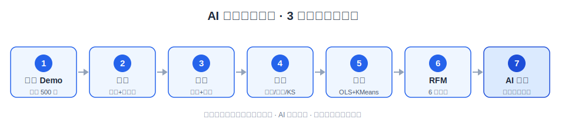

# AI 数据分析助手

> 可解释的 AI 数据分析助手 · 统计建模 + 自然语言洞察 + 可视化
> 求职作品集旗舰项目 — 统计学硕士 × AI 应用

[](https://github.com/your-name/ai-data-analysis-assistant/actions) <!-- 替换 your-name；CI 模板见 .github/workflows/deploy.yml -->

## ▶️ 3 分钟演示视频

> 🎬 录制方法见 [DEMO_SCRIPT.md](DEMO_SCRIPT.md)（含 Windows 录屏教程 + 逐字稿 + 托管方式）。
> 录好后把下方链接换成你的视频（YouTube 不公开 / Loom 均可，GitHub 会自动嵌入播放器）。

[](https://youtu.be/替换为你的视频ID)

## 🌐 在线体验（部署后替换链接）

- 前端（Vercel）：https://<你的Vercel应用>.vercel.app
- 后端 API 文档：https://<你的Railway后端>.up.railway.app/docs
- 本地一键起：`docker compose up --build` → 前端 http://localhost:3000

## 核心差异

- **8 项统计算法自实现**：OLS / K-Means / Welch t / 卡方 / KS / Pearson / IQR+Z-score / RFM —— 不靠"调包"糊弄，每个都写了对照验证。
- **全过程可解释**：每个分析返回统一信封 `data + explanation + meta`，`explanation` 含方法 / 假设 / 解读 / 局限，结论可追溯。
- **AI 不黑盒**：LLM 仅做"翻译器"——所有数字来自真实计算，AI 只把结构化结果转成自然语言，并标注每个发现的来源。
- **电商行业模板开箱即用**：RFM 用户分层 + 漏斗转化分析，配合一键生成的 demo 数据，无需自备数据即可体验。

## 技术栈

| 层 | 选型 | 理由 |
|----|------|------|
| 前端 | Next.js 14 (App Router) + TailwindCSS + Recharts + Zustand | 类型安全、SSR/路由开箱即用；Recharts 满足分析图表；Zustand 轻量状态、避免 Context 重渲染 |
| 后端 | FastAPI + Pandas + NumPy + SciPy + scikit-learn | 异步友好、自动 OpenAPI 文档；Pandas/NumPy 做数据管线，SciPy 提供分布 CDF/临界值 |
| AI | OpenAI API（**仅翻译，不计算**） | LLM 幻觉不可控，本项目把"算"与"说"解耦，数字 100% 来自统计模块 |
| 存储 | Parquet（数据落盘）+ SQLite（元数据） | 文件存储防内存爆量、重启不丢数；SQLite 轻量元数据索引 |
| 部署 | Docker（multi-stage）+ docker-compose | 后端多阶段瘦身 + 非 root；前端 standalone 输出最小运行镜像 |

## 自实现算法清单（含对照验证）

> 全部对照测试见 `backend/tests/step0X_validate.py`，`pytest` 可复现。

| # | 方法 | 自实现范围 | 对照验证（误差 / 指标） |
|---|------|-----------|------------------------|
| 1 | **OLS 回归** | β=(XᵀX)⁻¹Xᵀy（np.linalg.solve）、标准误/t/p/R²/调整R² 全手推 | vs **statsmodels**：系数 / R² / 标准误 / p 误差 **< 1e-6** |
| 2 | **K-Means** | k-means++ 初始化、Lloyd 迭代 + 空簇重初始化、轮廓系数、肘部 auto_k | vs **sklearn**：4 维 Iris **ARI = 0.716 ≥ 0.7**；向量化轮廓系数与 sklearn 一致 |
| 3 | **Welch t 检验** | Satterthwaite 自由度 + Cohen's d | vs **scipy.ttest_ind(equal_var=False)**：t / df 一致 |
| 4 | **卡方独立性检验** | 卡方统计量 + Cramér's V，自动剔除全零行列 | vs **scipy.chi2_contingency**：统计量 / p 一致 |
| 5 | **KS 正态性检验** | Lilliefors 临界值（n≤50 查表插值，n>50 用 0.886/√n） | vs **scipy.kstest**：小样本临界值对齐 |
| 6 | **Pearson 相关** | 手写协方差 + scipy t 双尾 p 值 | vs **scipy.pearsonr**：r / p 一致 |
| 7 | **IQR 异常检测** | 纯 NumPy：x∉[Q1−k·IQR, Q3+k·IQR] | 与分位数定义一致；Z-score 版 |z|>k 判异常 |
| 8 | **RFM 用户分层** | R/F/M 计算 + 五分位打分（R 反向）+ 规则分 6 群 | 与手动分群结果一致；返回分群占比 + Top500 矩阵 |
| — | 漏斗转化（模板） | 各步非空/非0人数、总体转化率、瓶颈定位 | 与手算转化率一致 |

**合理复用（非自实现）**：Isolation Forest、PCA 直接调用 scikit-learn——属工程取舍（投入产出比低、数学成熟），详见下方"设计决策"。

## 快速开始

### 前置条件

- Docker + Docker Compose（推荐，一条命令起全栈）
- **或** Python 3.11 + Node 20 分别本地运行
- OpenAI API Key（**可选**：未配置时 AI 报告自动降级为结构化摘要，其余功能不受影响）

### 方式一：Docker Compose（推荐）

```bash
# 1. 准备后端环境变量（填 OPENAI_API_KEY；留空则走降级）
cp backend/.env.example backend/.env
#    编辑 backend/.env，填入 OPENAI_API_KEY=sk-xxxx

# 2. 可选：把 key 透传给 compose（不设置也能跑，仅 AI 报告降级）
export OPENAI_API_KEY=sk-xxxx

# 3. 构建并启动
docker compose up --build

# 4. 访问
#    前端:        http://localhost:3000
#    后端 API 文档: http://localhost:8000/docs
#    健康检查:      http://localhost:8000/health
```

启动后可点首页「一键体验 Demo」自动生成一份电商示例数据并跳转到分析页。

### 方式二：不使用 Docker（本地开发）

```bash
# 后端
cd backend
python -m venv .venv && source .venv/bin/activate   # Windows: .venv\Scripts\activate
pip install -r requirements.txt
cp .env.example .env                                 # 填 OPENAI_API_KEY
uvicorn app.main:app --reload --port 8000

# 前端（另开终端）
cd frontend
npm install
cp .env.example .env.local                          # NEXT_PUBLIC_API_BASE 默认指向 localhost:8000
npm run dev                                          # http://localhost:3000
```

> 注意：`NEXT_PUBLIC_API_BASE` 在**构建期**内联进前端包。Docker 部署通过 `docker-compose.yml` 的 `build.args` 注入；本地 `npm run dev` 读取 `.env.local`。

## 项目结构

```
ai-data-analysis-assistant/
├── backend/
│   ├── app/
│   │   ├── main.py              # 入口：路由装配 / CORS / 生命周期(初始化 SQLite)
│   │   ├── config.py            # pydantic-settings 配置
│   │   ├── dependencies.py      # 依赖注入（数据集仓库）
│   │   ├── schemas/             # 请求/响应模型（统一信封 data/explanation/meta）
│   │   ├── routers/             # datasets / profiling / cleaning / stats / modeling / templates / insight / viz
│   │   ├── services/            # 业务编排（ingestion/profiling/cleaning/stats/modeling/templates/insight）
│   │   ├── core/stats_lib/      # ★ 自实现算法：ols / kmeans / hypothesis / distribution / correlation / anomaly / rfm / funnel
│   │   ├── store/               # Parquet + SQLite 存储层
│   │   ├── ai/llm.py            # LLM 翻译器（流式 / 降级 / 容错解析）
│   │   └── utils/               # 文件读取（编码链）、类型推断
│   ├── data/                    # 运行时落盘（gitignored）
│   ├── tests/                   # step0X_validate / step0X_http / step0X_e2e 对照测试
│   ├── requirements.txt
│   └── Dockerfile               # 多阶段 + 非 root
├── frontend/
│   ├── app/                     # App Router：/、/upload、/dataset/[id]/{overview,clean,stats,model,templates,report}、/methods、not-found、error
│   ├── components/              # Nav / AnalysisWizard / ExplainPanel / CoefficientTable / ClusterChart / charts
│   ├── lib/                     # api.ts（封装）、types.ts（类型）、markdown.ts（自实现迷你渲染器）
│   ├── store/                   # Zustand：useDatasetStore / useAnalysisStore
│   ├── public/                  # 静态资源（standalone 构建需要）
│   ├── package.json
│   ├── next.config.mjs          # output: "standalone"
│   └── Dockerfile               # 多阶段 deps→builder→runner
├── .github/workflows/deploy.yml # CI/CD 模板（lint + build）
├── docker-compose.yml           # 全栈编排（含健康检查）
├── README.md
└── BLOG_OUTLINE.md              # 技术博客写作大纲（求职作品集素材）
```

## API 端点概览

所有端点挂在 `/api/v1` 下，Swagger 文档 `/docs`。统一响应信封：

```json
{ "data": ..., "explanation": { "method":.., "assumptions":[..], "interpretation":.., "caveats":[..] }, "meta": { "method":.., "params":{..} } }
```

| 模块 | 方法 & 路径 | 说明 |
|------|------------|------|
| 接入 | `POST /datasets/upload` | 上传 CSV/Excel → 采样画像 + Parquet 落盘 |
| 接入 | `GET /datasets` | 数据集列表 |
| 接入 | `GET /datasets/{id}` | 元数据 |
| 接入 | `POST /datasets/demo` | 生成 ~500 行电商示例数据（无需自备数据） |
| 理解 | `GET /datasets/{id}/profile` | 逐列类型推断 + 描述统计 |
| 理解 | `GET /datasets/{id}/quality` | 数据质量报告（0–100 评分） |
| 清洗 | `POST /datasets/{id}/clean` | 缺失值处理（另存 `_clean.parquet`，原始不变） |
| 异常 | `POST /datasets/{id}/anomalies` | IQR / Z-score（自实现）/ Isolation Forest（sklearn） |
| 统计 | `POST /analysis/correlation` | Pearson 相关矩阵 + p 值矩阵 |
| 统计 | `POST /analysis/hypothesis` | Welch t / 卡方独立性检验 |
| 统计 | `POST /analysis/distribution` | KS 正态性检验 |
| 建模 | `POST /modeling/regression` | OLS 回归（自实现） |
| 建模 | `POST /modeling/clustering` | K-Means 聚类（自实现，auto_k） |
| 模板 | `POST /templates/rfm` | RFM 用户分层 |
| 模板 | `POST /templates/funnel` | 漏斗转化分析 + 瓶颈定位 |
| 洞察 | `POST /insight/report` | AI 报告（非流式，结构化 JSON） |
| 洞察 | `POST /insight/report/stream` | AI 报告（SSE 流式，打字机效果） |
| 可视化 | `GET /viz/{spec_id}` | 可视化 spec（待实现） |

## 设计决策

### 为什么自实现而不全用 sklearn？

8 项核心算法手写，是为了**体现统计建模能力**——这是统计学硕士作品集的说服力核心，面试可现场讲清每个公式与数值稳定的细节（如 OLS 用 `np.linalg.solve` 而非显式求逆、Welch 用 Satterthwaite 近似自由度）。

边界划分（投入产出比）：
- **核心计算 NumPy 手写**：OLS / K-Means / Welch t / 卡方 / KS / Pearson / IQR+Z-score / RFM
- **分布 CDF / p 值查表调 SciPy**：属成熟的底层数学库，重复造轮子无意义（KS 的 Lilliefors 临界值我们仍自建查表）
- **Isolation Forest、PCA 照用 sklearn**：数学成熟且工程价值高，自实现性价比低

### 为什么 AI 不做计算？

LLM 幻觉不可控、不可复现、不可溯源。本项目采用 **"LLM = 翻译器"** 架构：

```
结构化计算(NumPy/Pandas) → 注入 prompt → LLM 转自然语言 → 标注来源
```

好处：① 结论可溯源（每个关键发现带 `[相关性分析]` 等来源标签，可点击回溯）；② 数字可验证（全部来自真实统计模块）；③ 模型可替换（换任何 LLM 不影响计算正确性）。

**降级策略**：OpenAI 不可用 / 未配置 key / 解析失败时，自动回退为结构化摘要（分群占比、显著检验、回归摘要等），保证产品在任何情况下都有输出。

### 为什么 Chat 类接口不用，而用报告聚合？

避免"用户问一句、AI 编一通"。报告页聚合前序所有分析结果（概览 / 清洗 / 统计 / 建模），LLM 只在这一份**已验证数据**上做翻译，从源头杜绝编造。

## 部署（Vercel 前端 + Railway 后端）

零成本上线，简历里放可点击链接。环境变量细节见各 `*.env.example`。

> 📋 **完整步骤、联调顺序、故障排查清单见 [DEPLOY.md](DEPLOY.md)**。
> 前置：先把代码 push 到 GitHub（`git remote add origin <仓库> && git push -u origin main`；本仓库已 `git init` 并提交，且本次修复了会导致后端启动崩溃的 `CORS_ORIGINS` 解析问题）。

### 前端 → Vercel（免费）
1. 在 Vercel 导入本 GitHub 仓库。
2. 项目设置：**Root Directory = `frontend`**（框架自动识别 Next.js，详见 `frontend/vercel.json`）。
3. 添加环境变量：`NEXT_PUBLIC_API_BASE = https://<你的Railway后端>.up.railway.app/api/v1`
   （`NEXT_PUBLIC_*` 在 `next build` 时内联进包，必须构建前确定，详见 `frontend/.env.example`）。
4. Deploy → 拿到 `https://<app>.vercel.app`。

### 后端 → Railway（免费额度）
1. 在 Railway 导入同一仓库，服务 **Root Directory = `backend`**，Builder 选 Dockerfile（读取仓库根 `railway.toml`）。
2. 添加环境变量：
   - `CORS_ORIGINS = https://<你的Vercel应用>.vercel.app`（多个用逗号分隔）
   - `OPENAI_API_KEY = sk-...`（**可选**：不填则 AI 报告自动降级为结构化摘要，其余功能不受影响）
   - `ENV = production`（可选）
3. Deploy → 健康检查 `/health` 通过后即上线，拿到 `https://<app>.up.railway.app`。

> 注意：Railway 容器文件系统是临时的，重启后示例数据会清空，重新点「一键体验 Demo」即可；如需持久化可挂 Volume（Railway 付费项）。

## License

MIT
